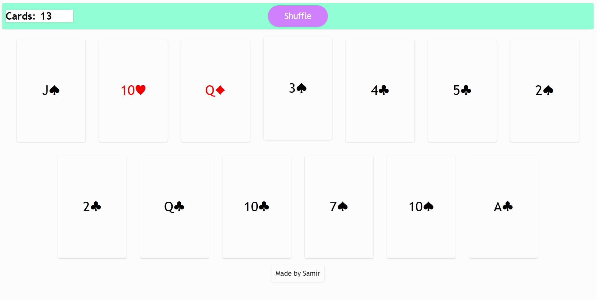

# Card - Shuffler 
### A simple and elegant card shuffler that I made using HTML/CSS/JS, primarily to practice box shadows on different elements. 
#### Click on the picture/the link below to try!

## [Click to open](https://redplusblue.github.io/card-shuffler/)

## Features: 
1. Can show a any number of random set of cards from a standard deck of 52. 

## What I used/learned: 
1. HTML: making a link open in a new tab. 
2. CSS: `:hover` , `transform` : `translate` , `rotate` ; `@keyframes` , `box-shadow`
3. JS: Objects, Event Listeners
